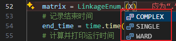

# TJU-Spring-2024-DataMining

 同济大学2024春数据分析与数据挖掘课程

# 思维过程

- **算法选择**：选择特定的距离计算准则（如单链接、完全链接、Ward链接），因为这三个计算法则有典型性并且各自适合不同特点的，比如不同形状的聚类数据。
- **设计决策**：利用并查集，最小生成树，链等数据结构和算法进行时间复杂度和空间复杂度的优化
- **代码结构**：start.py里主要是最后可视化结果还有算法入口的代码，agglomerative.py里是只用了math和numpy库自己实现的三种算法，data.py是从网上拉取数据集的代码，test.py是用现成库检查自己实现的结果正不正确的代码
- **代码思路**：首先就是start.py是入口，先调用data.py里的函数拿到数据集数据，然后根据枚举类选择我们要执行的三种计算准则之一（single、complete、ward），每个枚举项是一个函数，对应一种计算，输入为数据点的dataframe，输出为层级矩阵。ward和conplex的实现差不多，就是在更新距离的时候用的算法不同（一个计算簇间点最大距离，一个是簇间方差），single的话不需要更新距离，因为每次迭代只需要找距离最小的簇就行了，然后簇的话就可以用并查集来集合在一起，single可以用最小生成树算法，然后complex和ward就用链的数据结构来优化。最后算法搞出来的层级矩阵在start.py可视化的函数画几个图。

- **测试和验证**：有和真实标签值进行对比的外部指标，也有仅仅评价聚类质量的内部指标，当然还有运行时间

三种算法的基本步骤如下（就是凝聚层次聚类的基本步骤，每种算法具体的算法设计报告里有）：

1. 初始化：将每个样本点视为一个单独的聚类。
2. 计算所有聚类对之间的距离。
3. 合并距离最小的两个聚类。
4. 重复步骤 2 和 3，直到达到预设的聚类数目或满足某种终止条件。

# 执行步骤

下载对应python库，然后在start.py第52行的枚举类中选择想要实验的算法（每个枚举值是对应的一个函数，可以把传入的X参数经过聚类形成层级矩阵），然后直接运行start.py文件即可

