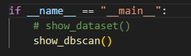
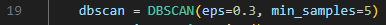
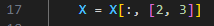

# 代码功能

这里有四个代码文件，下面分文件来介绍功能：

**DBSCAN.py**

这个文件里只有一个DBSCAN类，实现的是核心功能代码

**DBSCAN_reference.py**

这里是DBSCAN用sklearn库的实现，用于对照自己的实现是否正确

**main.py**

程序入口，这里包含了两个函数，一个是得到数据集数据并且可视化原始数据集，一个是得到数据集数据后调用自己的DBSCAN类方法实现DBSCAN聚类并输出结果和可视化

**util.py**

这里包含了四个函数，分别用于生成随机测试数据，可视化DBSCAN聚类结果，得到iris数据集数据，可视化iris数据集

# 思考过程

首先编写了一个sklearn库的实现，用于对照自己的实现是否正确，然后上网搜索并且阅读sklearn库源码，得到可以降低时空复杂度的idea并且把这些idea应用于自己实现的DBSCAN中，并且和之前的sklearn库的实现的测试结果对照一下看看有没有什么错，DBSCAN类初始化就是设置参数，然后只有一个方法叫fit，输入为数据点和特征，输出就是聚类好的结果。然后可视化还有获取数据的代码都整合到util.py里供其他文件调用，最后写一个入口函数main.py里可以实现实验功能，并且可以控制eps和min_samples的参数和选择数据集特征，其会调用DBSCAN.py和util.py里的东西共同完成：一个是得到数据集数据并且可视化原始数据集，一个是得到数据集数据后调用自己的DBSCAN类方法实现DBSCAN聚类并输出结果和可视化。

# 执行步骤

入口文件是**main.py**，可以选择是要可视化原始数据集还是实现DBSCAN聚类并输出结果和可视化，默认执行该文件会得到`eps=0.3, min_samples=5`时的聚类结果和可视化

在19行可以改参数（eps和min_samples）：

在17行可以选择数据集特征：

